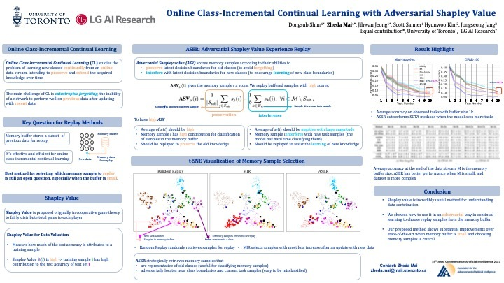

# Online Continual Learning


Official repository of 
* [Online Class-Incremental Continual Learning with Adversarial Shapley Value](https://arxiv.org/abs/2009.00093) (AAAI 2021)
* [Supervised Contrastive Replay: Revisiting the Nearest Class Mean Classifier in Online Class-Incremental Continual Learning](https://openaccess.thecvf.com/content/CVPR2021W/CLVision/html/Mai_Supervised_Contrastive_Replay_Revisiting_the_Nearest_Class_Mean_Classifier_in_CVPRW_2021_paper.html) (CVPR2021 Workshop)
* [Online Continual Learning in Image Classification: An Empirical Survey](https://arxiv.org/pdf/2101.10423.pdf) (Neurocomputing), [Official version](https://authors.elsevier.com/a/1e1YV3INukGu7J)


## Requirements


----
Create a virtual enviroment
```sh
virtualenv online-cl
```
Activating a virtual environment
```sh
source online-cl/bin/activate
```
Installing packages
```sh
pip install -r requirements.txt
```

## Datasets 

### Online Class Incremental
- Split CIFAR10
- Split CIFAR100
- CORe50-NC
- Split Mini-ImageNet

### Online Domain Incremental
- NonStationary-MiniImageNet (Noise, Occlusion, Blur)
- CORe50-NI
  
### Data preparation
- CIFAR10 & CIFAR100 will be downloaded during the first run
- CORE50 download: `source fetch_data_setup.sh`
- Mini-ImageNet: Download from https://www.kaggle.com/whitemoon/miniimagenet/download , and place it in datasets/mini_imagenet/
- NonStationary-MiniImageNet will be generated on the fly


## Algorithms 

* ASER: Adversarial Shapley Value Experience Replay(**AAAI, 2021**) [[Paper]](https://arxiv.org/abs/2009.00093)
* EWC++: Efficient and online version of Elastic Weight Consolidation(EWC) (**ECCV, 2018**) [[Paper]](http://arxiv-export-lb.library.cornell.edu/abs/1801.10112)
* iCaRL: Incremental Classifier and Representation Learning (**CVPR, 2017**) [[Paper]](https://arxiv.org/abs/1611.07725)
* LwF: Learning without forgetting (**ECCV, 2016**) [[Paper]](https://link.springer.com/chapter/10.1007/978-3-319-46493-0_37)
* AGEM: Averaged Gradient Episodic Memory (**ICLR, 2019**) [[Paper]](https://openreview.net/forum?id=Hkf2_sC5FX)
* ER: Experience Replay (**ICML Workshop, 2019**) [[Paper]](https://arxiv.org/abs/1902.10486)
* MIR: Maximally Interfered Retrieval (**NeurIPS, 2019**) [[Paper]](https://proceedings.neurips.cc/paper/2019/hash/15825aee15eb335cc13f9b559f166ee8-Abstract.html)
* GSS: Gradient-Based Sample Selection (**NeurIPS, 2019**) [[Paper]](https://arxiv.org/pdf/1903.08671.pdf)
* GDumb: Greedy Sampler and Dumb Learner (**ECCV, 2020**) [[Paper]](https://www.robots.ox.ac.uk/~tvg/publications/2020/gdumb.pdf)
* CN-DPM: Continual Neural Dirichlet Process Mixture (**ICLR, 2020**) [[Paper]](https://openreview.net/forum?id=SJxSOJStPr)
* SCR: Supervised Contrastive Replay (**CVPR Workshop, 2021**) [[Paper]](https://arxiv.org/abs/2103.13885) 

## Tricks
- Label trick [[Paper]](https://arxiv.org/pdf/1803.10123.pdf)
- Cross entropy with knowledge distillation [[Paper]](https://arxiv.org/abs/1807.09536)
- Multiple iterations [[Paper]](https://proceedings.neurips.cc/paper/2019/hash/15825aee15eb335cc13f9b559f166ee8-Abstract.html)
- Nearest Class Mean classifier [[Paper]](https://arxiv.org/abs/2004.00440)
- Separated Softmax [[Paper]](https://arxiv.org/abs/2003.13947)
- Review Trick [[Paper]](https://arxiv.org/abs/2007.05683)

## Run commands
Detailed descriptions of options can be found in [general_main.py](general_main.py)

### Sample commands to run algorithms on Split-CIFAR100
```shell
#ER
python general_main.py --data cifar100 --cl_type nc --agent ER --retrieve random --update random --mem_size 5000

#MIR
python general_main.py --data cifar100 --cl_type nc --agent ER --retrieve MIR --update random --mem_size 5000

#GSS
python general_main.py --data cifar100 --cl_type nc --agent ER --retrieve random --update GSS --eps_mem_batch 10 --gss_mem_strength 20 --mem_size 5000

#LwF
python general_main.py --data cifar100 --cl_type nc --agent LWF 

#iCaRL
python general_main.py --data cifar100 --cl_type nc --agent ICARL --retrieve random --update random --mem_size 5000

#EWC++
python general_main.py --data cifar100 --cl_type nc --agent EWC --fisher_update_after 50 --alpha 0.9 --lambda_ 100

#GDumb
python general_main.py --data cifar100 --cl_type nc --agent GDUMB --mem_size 1000 --mem_epoch 30 --minlr 0.0005 --clip 10

#AGEM
python general_main.py --data cifar100 --cl_type nc --agent AGEM --retrieve random --update random --mem_size 5000

#CN-DPM
python general_main.py --data cifar100 --cl_type nc --agent CNDPM --stm_capacity 1000 --classifier_chill 0.01 --log_alpha -300

#ASER
python general_main.py --data cifar100 --cl_type nc --agent ER --update ASER --retrieve ASER --mem_size 5000 --aser_type asvm --n_smp_cls 1.5 --k 3 

#SCR
python general_main.py --data cifar100 --cl_type nc --agent SCR --retrieve random --update random --mem_size 5000 --head mlp --temp 0.07 --eps_mem_batch 100
```

### Sample command to add a trick to memory-based methods
```shell
python general_main.py --review_trick True --data cifar100 --cl_type nc --agent ER --retrieve MIR --update random --mem_size 5000 
```

### Sample commands to run hyper-parameters tuning 
```shell
python main_tune.py --general config/general_1.yml --data config/data/cifar100/cifar100_nc.yml --default config/agent/mir/mir_1k.yml --tune config/agent/mir/mir_tune.yml
```
There are four config files controling the experiment.

- general config controls variables that are not changed during the experiment
- data config controls variables related to the dataset
- default method config controls variables for a specific method that are not changed during the experiment
- method tuning config controls variables that are used for tuning during the experiment


## Repo Structure & Description
    ├──agents                       #Files for different algorithms
        ├──base.py                      #Abstract class for algorithms
        ├──agem.py                      #File for A-GEM
        ├──cndpm.py                     #File for CN-DPM
        ├──ewc_pp.py                    #File for EWC++
        ├──exp_replay.py                #File for ER, MIR and GSS
        ├──gdumb.py                     #File for GDumb
        ├──iCaRL.py                     #File for iCaRL
        ├──lwf.py                       #File for LwF
        ├──scr.py                       #File for SCR
    
    ├──continuum                    #Files for create the data stream objects
        ├──dataset_scripts              #Files for processing each specific dataset
            ├──dataset_base.py              #Abstract class for dataset
            ├──cifar10.py                   #File for CIFAR10
            ├──cifar100,py                  #File for CIFAR100
            ├──core50.py                    #File for CORe50
            ├──mini_imagenet.py             #File for Mini_ImageNet
            ├──openloris.py                 #File for OpenLORIS
        ├──continuum.py             
        ├──data_utils.py
        ├──non_stationary.py
    
    ├──models                       #Files for backbone models
        ├──ndpm                         #Files for models of CN-DPM 
            ├──...
        ├──pretrained.py                #Files for pre-trained models
        ├──resnet.py                    #Files for ResNet
    
    ├──utils                        #Files for utilities
        ├──buffer                       #Files related to buffer
            ├──aser_retrieve.py             #File for ASER retrieval
            ├──aser_update.py               #File for ASER update
            ├──aser_utils.py                #File for utilities for ASER
            ├──buffer.py                    #Abstract class for buffer
            ├──buffer_utils.py              #General utilities for all the buffer files
            ├──gss_greedy_update.py         #File for GSS update
            ├──mir_retrieve.py              #File for MIR retrieval
            ├──random_retrieve.py           #File for random retrieval
            ├──reservoir_update.py          #File for random update
    
        ├──global_vars.py               #Global variables for CN-DPM
        ├──io.py                        #Code related to load and store csv or yarml
        ├──kd_manager.py                #File for knowledge distillation
        ├──name_match.py                #Match name strings to objects 
        ├──setup_elements.py            #Set up and initialize basic elements
        ├──utils.py                     #File for general utilities
    
    ├──config                       #Config files for hyper-parameters tuning
        ├──agent                        #Config files related to agents
        ├──data                         #Config files related to dataset
    
        ├──general_*.yml                #General yml (fixed variables, not tuned)
        ├──global.yml                   #paths to store results 

## Duplicate results

The hyperparameters used in the ASER and SCR papers can be found in the folder `config_CVPR` to duplicate the papers' results. 

## Citation 

If you use this paper/code in your research, please consider citing us:

**Supervised Contrastive Replay: Revisiting the Nearest Class Mean Classifier in Online Class-Incremental Continual Learning**

[Accepted at CVPR2021 Workshop](https://arxiv.org/abs/2103.13885).
```
@inproceedings{mai2021supervised,
  title={Supervised Contrastive Replay: Revisiting the Nearest Class Mean Classifier in Online Class-Incremental Continual Learning},
  author={Mai, Zheda and Li, Ruiwen and Kim, Hyunwoo and Sanner, Scott},
  booktitle={Proceedings of the IEEE/CVF Conference on Computer Vision and Pattern Recognition},
  pages={3589--3599},
  year={2021}
}
```

**Online Continual Learning in Image Classification: An Empirical Survey**

Published in Neurocomputing, [official version](https://authors.elsevier.com/a/1e1YV3INukGu7J)<br/>
Preprint on arXiv [here](https://arxiv.org/pdf/2101.10423.pdf).

```
@article{MAI202228,
title = {Online continual learning in image classification: An empirical survey},
journal = {Neurocomputing},
volume = {469},
pages = {28-51},
year = {2022},
issn = {0925-2312},
doi = {https://doi.org/10.1016/j.neucom.2021.10.021},
url = {https://www.sciencedirect.com/science/article/pii/S0925231221014995},
author = {Zheda Mai and Ruiwen Li and Jihwan Jeong and David Quispe and Hyunwoo Kim and Scott Sanner}
}
```

**Online Class-Incremental Continual Learning with Adversarial Shapley Value**

[Accepted at AAAI2021](https://arxiv.org/abs/2009.00093)
```
@inproceedings{shim2021online,
  title={Online Class-Incremental Continual Learning with Adversarial Shapley Value},
  author={Shim, Dongsub and Mai, Zheda and Jeong, Jihwan and Sanner, Scott and Kim, Hyunwoo and Jang, Jongseong},
  booktitle={Proceedings of the AAAI Conference on Artificial Intelligence},
  volume={35},
  number={11},
  pages={9630--9638},
  year={2021}
}
```

## Contact & Contribution
- [Zheda Mai](https://zheda-mai.github.io/) (Corresponding author)  
zheda.mai@mail.utoronto.ca
- [Ruiwen Li](https://www.linkedin.com/in/ruiwen-li-4a272b55/)
- [Dongsub Shim](https://github.com/DongsubShim)


## Acknowledgments
- [MIR](https://github.com/optimass/Maximally_Interfered_Retrieval)
- [GSS](https://github.com/rahafaljundi/Gradient-based-Sample-Selection)
- [CN-DPM](https://github.com/soochan-lee/CN-DPM)
- [GDumb](https://github.com/drimpossible/GDumb)
- [AGEM](https://github.com/facebookresearch/agem)

## Note
The PyTorch implementation of ASER in this repository is more efficient than the original TensorFlow implementation and has better performance.
The results of the ASER paper can be reproduced in the [original TensorFlow implementation repository](https://github.com/RaptorMai/ASER). 
